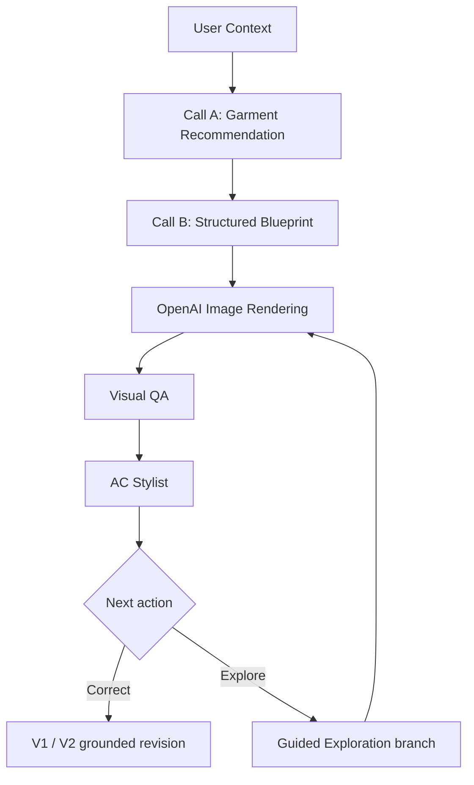

# AC — Context-Aware Cultural Remix Co-pilot

AC is a context-aware co-pilot for exploring and remixing Vietnamese traditional dress (**Việt phục**) while keeping cultural reasoning explicit, evidence-aware, and separate from image-generation authority.

Built for **AI Arena Vietnam 2026**.

## What AC does

AC helps a user move from a real-world context to a grounded outfit concept:

1. **Context** — occasion, style, wearer presentation, modernity level, custom intent.
2. **Recommendation** — select a suitable garment from the supported MVP scope.
3. **Blueprint** — build a structured outfit proposal: palette, fabric, lower garment, footwear, accessories, and preserved cultural traits.
4. **Image rendering** — generate a realistic 3:4 lookbook image.
5. **Visual QA** — inspect only what is visually assessable, separate cultural identity from outfit fidelity, and avoid speculative PASS/FAIL judgments.
6. **AC Stylist** — explain the result in natural Vietnamese and offer grounded corrections when allowed.
7. **Guided Exploration** — branch into more traditional, more remixed, or alternative directions without overwriting the root result.

## Supported garments

The current MVP is intentionally limited to exactly three garments:

- **Áo ngũ thân tay chẽn** (`ngu_than_chen`)
- **Áo tấc / Ngũ thân tay thụng** (`ao_tac`)
- **Áo tứ thân** (`ao_tu_than`)

No other garment should be added without an explicit product and cultural-knowledge decision.

## Cultural grounding

The application does **not** treat an LLM or image model as a historical authority.

Current in-repo cultural facts are projected through:

- `src/data/culturalKnowledgePack.ts`
- approved project contracts and future approved cultural supplements

The upstream research source is **AC — Research & Cultural Knowledge Master v1.0 FINAL**.

Evidence status is restricted to:

`VERIFIED | PROBABLE | APPROXIMATE | DISPUTED | UNKNOWN`

Historical facts, interpretations, and contemporary styling recommendations must remain distinguishable.

## Runtime architecture



### Model roles

- **Recommendation / Call A:** `gemini-3.5-flash-lite` only
- **Blueprint / Call B:** `gemini-3.5-flash-lite` only
- **Guided Exploration Blueprint:** `gemini-3.5-flash-lite` only
- **Visual QA:** separate task-specific Gemini pool; benchmarked independently
- **Image generation:** OpenAI image provider configured through environment variables

Image models are rendering/editing services only. They are never cultural authorities.

## Current engineering principles

- Draft edits make **zero API calls** until explicit commit.
- Root and exploration branches maintain independent lineage.
- Explicit wearer presentation (`Nam` / `Nữ`) is preserved through a lineage.
- V0 is the original image; at most two automatic corrections are allowed: V1 and V2.
- `NOT_ASSESSABLE` is preferred over speculative visual certainty.
- QA verdicts are independent of the remaining revision budget.
- API clients validate HTTP status, content type, and the canonical API response marker before parsing JSON.
- Session reset clears session-scoped state and runtime artifacts.
- Runtime quota quarantine state is not version-controlled.

## Repository governance

Before changing implementation, AI coding agents must read:

1. `AGENTS.md`
2. `GEMINI.md` when using Gemini-based coding workflows
3. `docs/PROJECT_CONSTITUTION.md`
4. `docs/KNOWN_FAILURES.md`
5. `docs/ROADMAP.md`

These files exist to prevent repeated regressions and accidental changes to locked architecture.

## Tech stack

- React 19
- TypeScript
- Vite
- Express
- `@google/genai`
- OpenAI API
- Sharp
- Tailwind CSS

## Local setup

### 1. Install dependencies

```bash
npm install
```

### 2. Configure environment

Copy `.env.example` to a local environment file and provide the required keys.

Current variables include:

```env
GEMINI_API_KEY=
APP_URL=
OPENAI_API_KEY=
IMAGE_PROVIDER=openai
IMAGE_PROVIDER_MODEL=gpt-image-2.5-flare
IMAGE_GENERATION_TIMEOUT_MS=120000
IMAGE_EPHEMERAL_TTL_MS=900000
```

Do not commit local environment files or secrets.

### 3. Run development server

```bash
npm run dev
```

### 4. Verification

```bash
npm run lint
npm run build
```

Deterministic regression suites are maintained under `tests/`.

## Current project status

**Track A — LIVE VERIFIED**

Verified areas include:

- Draft/Commit flow
- Call A / Call B routing discipline
- realistic 3:4 lookbook generation
- Visual QA v2 baseline
- AC Stylist primary QA experience
- V0 → V1 → V2 correction contract
- root/branch lineage
- wearer-context propagation
- Guided Exploration placement/gating
- idle-session reset
- cross-API non-JSON hardening

The project is **not complete**. Cultural Knowledge Supplement v1.1 and future features remain under active development.

## Planned features

### AC Chat Assistant
A grounded, read-first assistant using `gemini-3.5-flash-lite` for questions inside the approved Việt phục knowledge scope. It must not use model pretraining as silent historical authority.

### Personal Portrait Try-on
A user may provide a portrait/reference image so the rendered wearer can preserve that person's recognizable appearance while applying the selected AC outfit. Portrait references must be ephemeral and must not become cultural evidence.

See `docs/ROADMAP.md` for sequencing.

## License / competition note

This repository is currently maintained as an AI Arena Vietnam 2026 competition project. Licensing and redistribution terms should be added explicitly before broader reuse.
