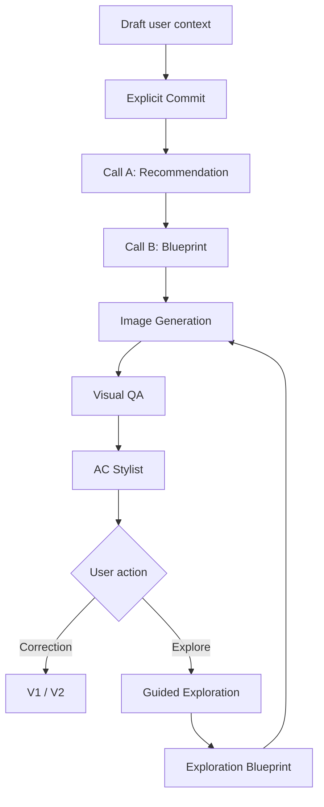

# AC Architecture

Status: **Current high-level architecture**

## Main flow



## Client responsibilities

The React client manages:

- draft/committed UX,
- recommendation/Blueprint presentation,
- lineage switching,
- lookbook state,
- Visual QA presentation,
- AC Stylist,
- persistence/hydration,
- idle-session behavior,
- safe API consumption.

Important services include:

- `src/services/geminiService.ts`
- `src/services/lookbookService.ts`
- `src/services/visualQAService.ts`
- `src/services/sessionPersistence.ts`
- `src/services/visualQAPersistence.ts`
- `src/services/idleSessionManager.ts`

## Server responsibilities

The Express server owns:

- Gemini routing,
- model health/circuit breaker,
- quota quarantine,
- recommendation/Blueprint endpoints,
- visual prompt compilation,
- image provider calls,
- ephemeral image bytes,
- Visual QA aggregation,
- canonical API response boundary.

Key services include:

- `server/services/modelRegistry.ts`
- `server/services/modelRouter.ts`
- `server/services/circuitBreaker.ts`
- `server/services/quotaQuarantine.ts`
- `server/services/culturalPolicyService.ts`
- `server/services/visualPromptCompiler.ts`
- `server/services/openAIImageProvider.ts`
- `server/services/ephemeralImageStore.ts`
- `server/services/visualQAAggregator.ts`

## Knowledge boundary

Machine-readable cultural knowledge currently lives in:

`src/data/culturalKnowledgePack.ts`

LLMs consume approved knowledge; they do not define it.

Future Cultural Knowledge Supplement v1.1 should extend structured knowledge rather than scatter cultural rules across prompts/components.

## Model boundary

### Gemini structured planning
Recommendation, Blueprint, and Exploration Blueprint currently use `gemini-3.5-flash-lite` only.

### Gemini Visual QA
Separate perception workload with independently benchmarked routing.

### OpenAI image provider
Renders visual output from an explicit brief.

The image provider is not cultural authority.

## Persistence boundary

Browser persistence:

- `ac_session_v1`
- `ac_visual_qa_v1`

They contain structured session/QA metadata, not image bytes or API secrets.

Server image bytes use an in-memory ephemeral store with TTL.

## API boundary

Client JSON calls are hardened against proxy/SPA HTML responses.

Expected sequence:

```text
fetch
→ status check
→ content-type check
→ canonical AC response-marker check
→ JSON parse
```

## State boundary

The system distinguishes:

- mutable DraftContext,
- committed context,
- active outfit fingerprint,
- immutable GenerationSnapshot,
- root lineage,
- exploration branch lineage,
- revision-specific QA state.

Do not flatten these into one mutable global outfit object.

## Visual QA boundary

```text
Vision observations
→ assessability
→ deterministic cultural/fidelity interpretation
→ actionability
→ AC Stylist narration
```

This separation exists to reduce hallucinated cultural judgments.

## Session lifecycle

Session reset clears session-scoped product state and ephemeral session artifacts through the canonical reset path.

Idle manager:

- warns after 2m30 of true inactivity,
- resets at 3m,
- defers destructive reset while meaningful work is in flight.

## Planned extensions

### G1/G2 — Cultural Knowledge Supplement v1.1
Adds wearer/styling/accessory compatibility as structured, evidence-aware policy.

### G3 — AC Chat Assistant
Grounded read-first assistance using approved AC knowledge.

It should not silently mutate outfit state.

### G4 — Portrait Try-on
Ephemeral portrait-reference pipeline integrated with existing lineage/snapshot rules.

See `docs/PRIVACY_AND_USER_IMAGES.md` and `docs/ROADMAP.md`.
